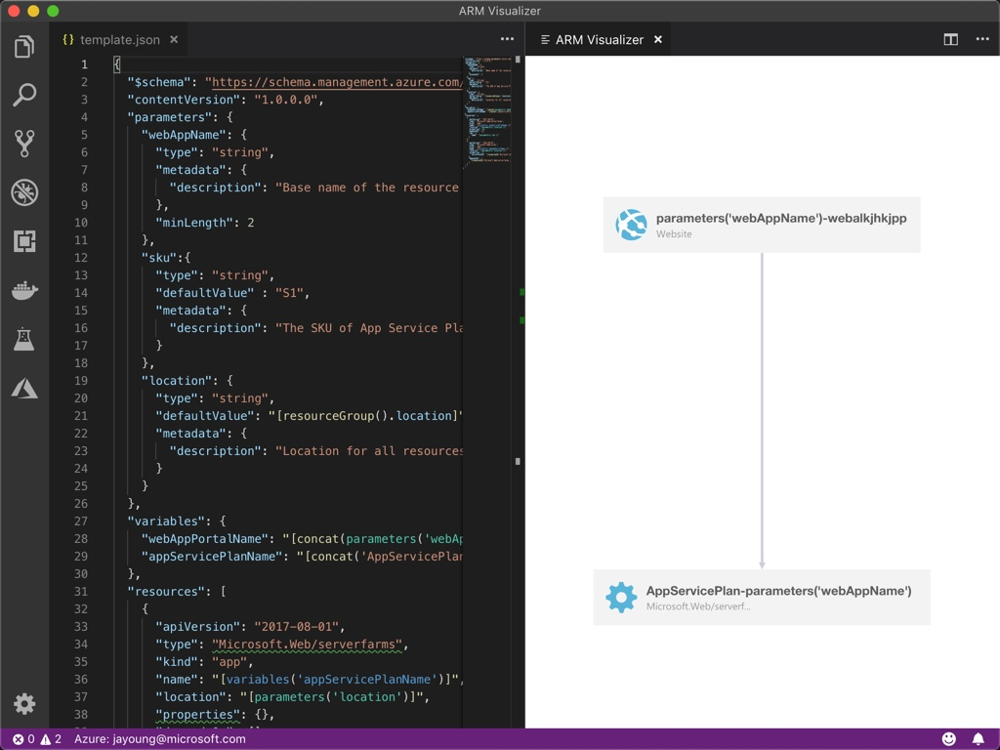
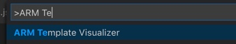

Visualize your Azure ARM template dependencies as a tree. Think of it as Vizio for Azure!

## Usage

1. Open the command palatte using `⇧⌘P` on a mac, or `Ctrl+Shift+P` on Windows.
1. Start to type "Arm Template Visualizer" and click on it.

1. You should now see the preview side-by-side with your template code.

## Contributors

* Jason Young
* Shenglong Li

## Nerdy Stuff

If you want to build and debug your own copy of this add-in, you can do that!

1. Run `npm install` to restore the dependencies
1. Run `npm run watch` to start the TypeScript transpilation process